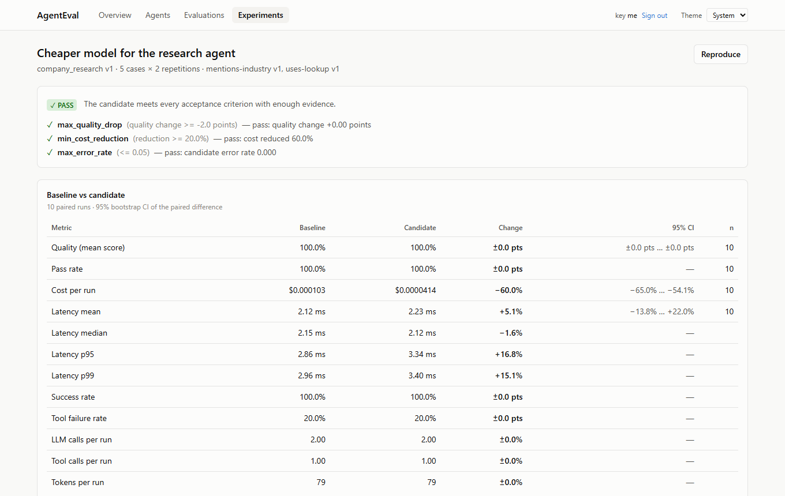
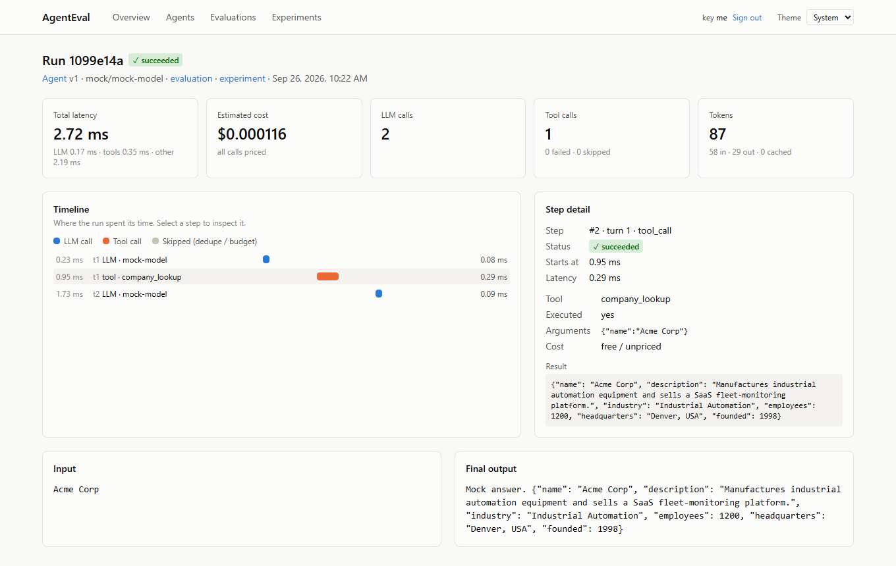
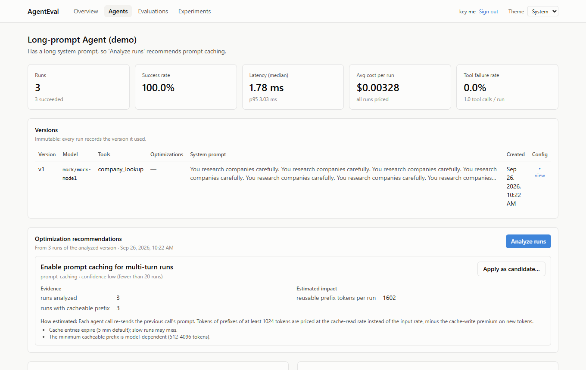
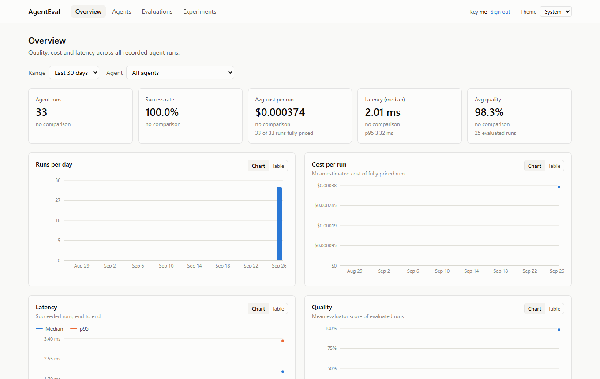

# AgentEval

**Evaluate and optimize LLM agents on measured quality, cost and latency.**

AgentEval runs your AI agent against a test dataset, records every model call and tool
call, scores the answers, and prices each run. It then compares two versions of the agent
(say, a cheaper model or a new prompt) on the same cases and gives a verdict (PASS, FAIL
or INCONCLUSIVE) against thresholds you set. The question it answers:

> Can this agent produce the same quality for less money and less time?



## What it does

- **Traces every run.** Each LLM call and tool call, with tokens, estimated cost, latency
  and a step timeline. Mirrored to OpenTelemetry.
- **Evaluates quality.** Rule-based checks (required text, regex, JSON schema, tool usage)
  and an LLM judge (correctness, relevance, groundedness, completeness, instruction
  following), with the judge's reasoning kept for every verdict.
- **Compares versions fairly.** Baseline and candidate run on the same cases, interleaved and
  repeated. Results are paired, with 95% confidence intervals, and the verdict needs
  statistical support, not just a better average.
- **Recommends optimizations from evidence.** Parallel tool calls, removing duplicate calls,
  tool budgets, prompt caching, model routing. Each comes with the data behind it, and
  one click creates the experiment that tests it.
- **Tracks cost exactly.** A dated price list (with sources) for Claude, OpenAI and Groq
  models. Past runs keep the price they were charged at.
- **Works with several providers.** Anthropic (Claude), OpenAI, Groq, and an offline mock
  model for free testing.
- **Built for production.** API keys (stored hashed), rate limits, a background worker that
  resumes after crashes, structured logs with secret redaction, CI with unit, integration,
  evaluation and browser tests.

| Run trace | Evidence-based recommendation |
|---|---|
|  |  |



## Quick start

You need **Docker Desktop** and **Git**. No AI API keys are needed for the demo.

```bash
git clone <repository-url> agenteval
cd agenteval
cp .env.example .env
docker compose up -d --build
docker compose exec api python -m app.auth create "me"   # prints your sign-in key
docker compose exec api python -m app.demo               # loads demo data (free, offline)
```

Open **http://localhost:3000** and sign in with the `ae_...` key.
The API and its interactive docs are at **http://localhost:8000/docs**.

The demo runs on a mock model, so its scores and costs are placeholders. Add your OpenAI,
Groq or Anthropic key to `.env` to evaluate real models.

## Online demo

A lighter version runs on Streamlit: the same engine, a private temporary workspace per
visitor, the free mock model by default, and your own API key if you want to try a real
model. See [streamlit_app/](streamlit_app/README.md). (Public link added once deployed.)

## Documentation

| Guide | For |
|---|---|
| [Getting started](docs/getting-started.md) | Installing and running it, step by step |
| [User guide](docs/user-guide.md) | Evaluating your own agents with real models: agents, datasets, evaluators, experiments, optimizations, prices |
| [Troubleshooting](docs/troubleshooting.md) | Common problems and fixes |
| [Architecture](docs/architecture.md) | How the pieces fit together |
| [Operations](docs/operations.md) | Configuration, API keys, worker, tracing, CI, migrations |
| [Design FAQ](docs/design-faq.md) | Why things work the way they do |
| [Decision records](docs/decisions.md) | Architectural decisions, one by one |

## Tech stack

| Layer | Technology |
|---|---|
| API | Python 3.12, FastAPI, Pydantic, SQLAlchemy, Alembic |
| Data | PostgreSQL, Redis |
| Background work | Celery (leases + crash recovery) |
| LLM providers | Anthropic SDK, OpenAI SDK (OpenAI and Groq) |
| Observability | OpenTelemetry, structured JSON logs |
| Dashboard | React, TypeScript, Tailwind CSS, Recharts |
| Tests | pytest, Vitest, Testing Library, Playwright |
| Delivery | Docker Compose, GitHub Actions |

## Project layout

```text
backend/
  app/
    api/           HTTP endpoints
    engine/        agent loop, tracer, optimization options, model router
    providers/     Anthropic, OpenAI-compatible (OpenAI, Groq) and mock adapters
    evaluation/    evaluators, LLM judge, evaluation runner and summaries
    experiments/   acceptance criteria, paired comparison, verdict
    optimization/  recommendation analyzer
    costs/         price list and cost calculation
    metrics/       statistics (percentiles, bootstrap confidence intervals)
    auth.py, ratelimit.py, worker.py, leases.py, recovery.py, telemetry.py, demo.py
  datasets/        example dataset (also the CI regression suite)
  migrations/      database migrations
  tests/
frontend/          React dashboard (+ Playwright end-to-end test in e2e/)
docs/              guides and design documents
.github/workflows/ CI pipeline
```

## Tests

```bash
cd backend && uv sync && uv run pytest          # 167 tests, no database or API keys needed
cd frontend && npm install && npm test          # 16 unit tests
cd streamlit_app && pip install -r requirements.txt pytest && python -m pytest tests   # 7 demo tests
```

CI runs lint, unit tests, integration tests (plus migrations on PostgreSQL), the
evaluation regression suite, Docker builds, and a browser test of the whole optimization
loop on the full stack. All of it uses the mock model, so it needs no secrets and costs
nothing.
